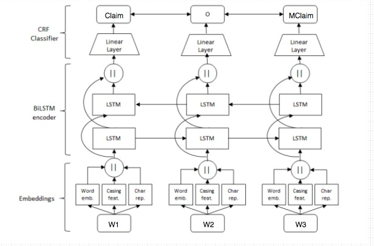

# Argument mining with BiLSTM
Implementación de una red BiLSTM-CNN-CRF usada para Sequence Tagging. Adaptación para Argument Mining. Flexibilización de input y reporte de hiperparametros.

## Objetivos
Basandonos en los repositorios de [UKPLab](https://github.com/UKPLab):

- https://github.com/UKPLab/acl2017-neural_end2end_am
- https://github.com/UKPLab/emnlp2017-bilstm-cnn-crf


- Introducirnos en las redes neuronales usando el framework *Keras* conociendo sus distintos backends.
- Conocer las diversas capas y sus utilidades.

Adaptar el código para..
- Utilizar la ultima version de Keras y TF para poder utilizar CNNs sin necesidad de usar otro backend.
- Desarrollar un entorno para la identificación y etiquetado de argumentos en textos del idioma inglés.
- Proponer alternativas de embeddings distintos para entrenamiento/evaluación.
- Flexibilizar input para formato texto o formato CoNLL.
- Reportar resultados con diversos parámetros.

## Arquitectura



## Instrucciones para su uso
### Kickstart

```
$ source kickstart.sh
```
Esto creará un entorno virtual dentro de la carpeta ```.env```, instalará las librerías necesarias y se crearán las carpetas vacias ```tmp/``` donde se almacenarán los etiquetados durante las epocas de entrenamiento con el formato: ```[]_[].txt``` , y  ```pkl/```, lugar donde se guardará el preproceso con el embedding seleccionado sobre el corpus de entrenamiento con el formato: ```[dataset_name]_[embedding_filename].pkl```.


### Archivos de entrenamiento
Se proponen 2 tipos de datasets. 
- Uno simple con las categorias de etiquetado básico tales como **Premise**, **Claim**, **MajorClaim**, **O** sin distinguir el caso de que sea a favor o en contra en el caso de las premisas y las afirmaciones. Este dataset está disponible en ```/data/am_simplest/```. En el caso de querer reetiquetar en este formato un essay en formato CoNLL usar el script [util/tag_simplifier.py](util/tag_simplifier.py)

- Otro completo con la adición de las etiquetas **:For** y **:Against** sobre las ya prpuestas. Este dataset se encuentra dentro de ```/data/am/```

Ambos dataset estas listos y dispuestos en formato CoNLL para ser entrenados. **dev.txt, train.txt** para entrenar la red y **test.txt** para probar los resultados.

### Mas archivos de evaluación
Si se necesitaran mas ejemplos de archivos pueden obtenerse [https://www.ukp.tudarmstadt.de/fileadmin/user_upload/Group_UKP/data/argument-recognition/ArgumentAnnotatedEssays-1.0.zip](https://www.ukp.tudarmstadt.de/fileadmin/user_upload/Group_UKP/data/argument-recognition/ArgumentAnnotatedEssays-1.0.zip)

O correr el script siguiente y los tendrán disponibles en **example_essays** en su formato *.txt* para ser evaluados y comparados con su archivo etiquetado *.ann*
```
$ download_examples
```

### Obtener modelo entrenado
Para entrenar un modelo correr el siguiente comando
```
$ python Train_AM.py [dataset] [embedding] [opts]
```
donde las opciones para cada parametro se detallan debajo.

- **dataset**: am, am_simplest
- **embedding**: levy, word2vec, glove
- **[opts]**: --optimizer, --classifier, --cnn , --help

Durante el entrenamiento, al final de cada época, se evalúa el F1. Si éste es mayor que el máximo F1 que se venía registrando anteriormente, se guarda el nuevo modelo en el directorio models.

Si al cabo de cinco épocas (por default) no se obtienen mejoras en F1, entonces se termina el entrenamiento.

### Etiquetar texto con modelo entrenado

Para etiquetar texto ajeno con un modelo preentrenado ejecutar el comando RunModel de la siguiente forma.
```
$ python RunModel.py /models/[dataset]/AM_TAG/[selectedModel].h5 [input.txt]
```
El etiquetado se imprimirá por stdout, aunque si un archivo de salida fuera necesario es posible su redirección concatenando ```> [output_file]```

### Evaluar eficiencia

Para evaluar eficiencia podemos comparar las etiquetas del output generado por RunModel y las etiquetas verdaderas del texto utilizado para correr el modelo.
Para ello ejecutamos:
```
$ python Eval.py [tagged_text] [model_output] [results.txt]
```
Se guardarán los resultados en results.txt y serán de la forma: 
```
Tag errors found: 112 (0.73% acc)

Errors:
Line: 111,	 Word: through, Tag: Claim, Pred: O
Line: 112,	 Word: cooperation, Tag: Claim, Pred: O
Line: 113,	 Word: ,, Tag: Claim, Pred: O
Line: 118,	 Word: interpersonal, Tag: Claim, Pred: Premise
.
.
.
```

## Adaptacion de input:

En caso de que se ejecute RunModel con un texto en formato CoNLL, se generará automáticamente un nuevo archivo con el texto crudo con el cual se correrá el modelo.

## Análisis de resultados

| am_simplest 	              | f1 promedio(dev) | f1 promedio(test) | epochs model |
|-----------------------------|------------------|-------------------|--------------|
| crf-adam             	      | 0.71             | 0.71              | 34 epochs    |
| softmax-nadam               | 0.72             | 0.73              | 20 epochs    |
| softmax-sgd                 | 0.48             | 0.50           	 | 44 epochs    |
| crf-nadam (levy)            | 0.71             | 0.70        	     | 32 epochs    |
| softmax-nadam (glove 100d)  | 0.69             | 0.70        	     | 34 epochs    |
| softmax-nadam-paragraph     | 0.70             | 0.72        	     | 16 epochs    |
| softmax-nadam-paragraph(cnn)| 0.71             | 0.74        	     | 27 epochs    |
	

| am_full(levy)               | f1 promedio(dev) | f1 promedio(test) | epochs model |
|-----------------------------|------------------|-------------------|--------------|
| charEmbedding(lstm)-crf     | 0.46             | 0.68              | 20 epochs    |
| charEmbedding(cnn)-crf      | 0.48             | 0.46              | 39 epochs    |
| charEmbeddings(cnn)-softmax | 0.46             | 0.71              | 23 epochs    |
| softmax                     | 0.44             | 0.47              | 49 epochs    |
| softmax-paragraph(cnn)      | 0.51             | 0.56              | 28 epochs    |

